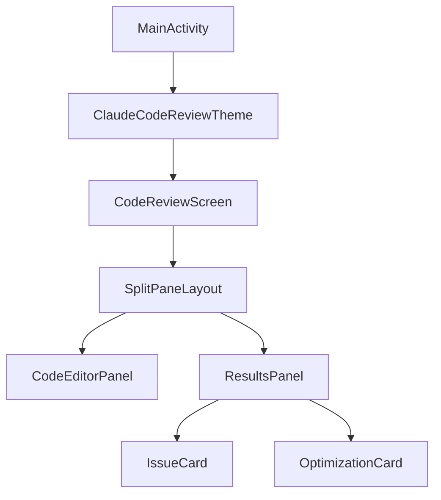
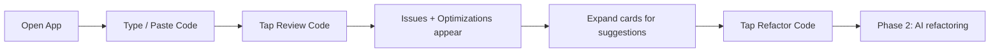

# Claude Code Review

An Android app that takes Kotlin code as input, reviews it for issues and optimisations, and offers one-tap refactoring — built with Jetpack Compose and Material 3.

## How It Works

```
┌──────────────────────────────────────────────────────────┐
│                      Code Review                    ☀/🌙 │  ← Top bar + theme toggle
├────────────────────────────┬─────────────────────────────┤
│                            │  Review Results             │
│   Code Editor              │  ┌─────────┬─────────────┐ │
│                            │  │ Issues(4)│ Optimize(4) │ │
│  1 │ fun fetchUser(…) {   │  ├─────────┴─────────────┤ │
│  2 │   val user = …       │  │ ● ERROR   L:14         │ │
│  3 │   println(user.name) │  │   Null pointer risk    │ │
│  4 │   …                  │  │   ▸ Fix: user?.name    │ │
│                            │  │                         │
│                            │  │ ● WARNING  L:27        │ │
│                            │  │   Mutable list exposed │ │
│  12 lines · 340 chars      │  │                         │
│          [▶ Review Code]   │  │       [⚙ Refactor Code]│ │
└────────────────────────────┴─────────────────────────────┘
          portrait: stacked          landscape: side-by-side
```

## Architecture

The project follows a clean, modular structure — every composable is reusable and testable in isolation.

```
app/src/main/java/com/naveedali/claudecodereview/
│
├── model/                       ← Pure data, no Android deps
│   ├── CodeIssue.kt             IssueSeverity enum + data class
│   ├── Optimization.kt          OptimizationType enum + data class
│   └── ReviewResult.kt          Aggregated result + mock data for previews
│
├── ui/
│   ├── theme/                   ← Material 3 theming
│   │   ├── Color.kt             Semantic colour palette (editor, severity, chips)
│   │   ├── Theme.kt             Light + Dark colour schemes
│   │   └── Type.kt              Typography + CodeEditorTextStyle, LineNumberTextStyle
│   │
│   ├── components/              ← Reusable building blocks
│   │   ├── CodeEditorPanel.kt   Styled code editor with line numbers
│   │   ├── IssueCard.kt         Expandable card, colour-coded by severity
│   │   ├── OptimizationCard.kt  Expandable card with before/after code diff
│   │   ├── ResultsPanel.kt      Tab bar (Issues / Optimizations) + Refactor button
│   │   └── SplitPaneLayout.kt   Adaptive layout — portrait stacked, landscape side-by-side
│   │
│   └── screens/
│       └── CodeReviewScreen.kt  Root screen — owns UI state, wires panes together
│
└── MainActivity.kt              Single activity, owns theme toggle state
```

### Component Graph

> Open `docs/architecture.mermaid` in any Mermaid renderer (GitHub, VS Code plugin, mermaid.live) to see the full interactive diagram.



### User Flow

> See `docs/user-flow.mermaid` for the full flow diagram.



## Key Compose Concepts (Learning Reference)

Each concept is used in a real component — search the codebase for the annotation to see it in context.

| Concept | Where Used | What It Does |
|---|---|---|
| `remember { mutableStateOf() }` | CodeReviewScreen | Preserves state across recompositions |
| `mutableIntStateOf` | ResultsPanel | Optimised int state (avoids boxing) |
| `BoxWithConstraints` | SplitPaneLayout | Reads available size to pick layout direction |
| `BasicTextField` + `decorationBox` | CodeEditorPanel | Custom-styled text input with placeholder |
| `AnimatedVisibility` | IssueCard, OptimizationCard | Smooth expand/collapse for card details |
| `LazyColumn` with `key` | ResultsPanel | Efficient scrollable list with stable keys |
| `TabRow` + `Tab` | ResultsPanel | Material 3 tabbed navigation |
| State hoisting | MainActivity → Screen → Panels | State owned high, events flow up |

## Phased Roadmap

| Phase | Scope | Status |
|---|---|---|
| **1 — UI Only** | All composables, theming, mock data, adaptive layout | Done |
| **2 — ViewModel** | Hoist state into ViewModel, add coroutines, loading states | Planned |
| **3 — AI Integration** | Wire Review + Refactor buttons to an AI service | Planned |
| **4 — Polish** | Syntax highlighting, diff view for refactored code, animations | Planned |

## Build & Run

```bash
# Clone
git clone https://github.com/naveedali/claude-code-review.git
cd claude-code-review

# Open in Android Studio (Hedgehog or newer)
# Sync Gradle, then Run ▶ on an emulator or device (API 24+)
```

### Requirements

- Android Studio Hedgehog (2023.1.1) or newer
- JDK 11+
- Android SDK 36
- Min SDK 24 (Android 7.0)

## License

MIT
