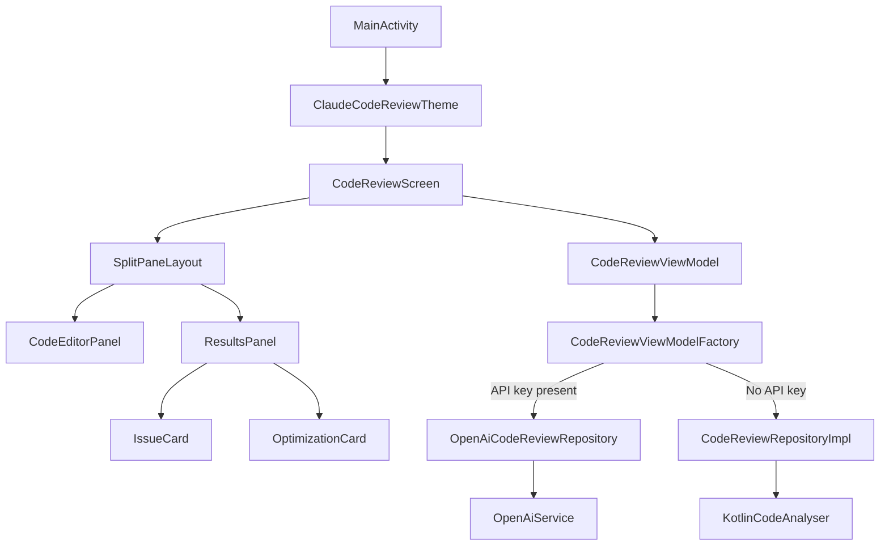
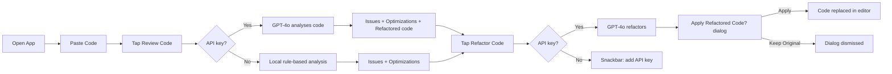

# Claude Code Review

An Android app that takes Kotlin code as input, reviews it for issues and optimisations using GPT-4o, and offers one-tap AI-driven refactoring — built with Jetpack Compose and Material 3.

## How It Works

```
┌──────────────────────────────────────────────────────────┐
│                      Code Review                    ☀/🌙 │  ← Top bar + theme toggle
├────────────────────────────┬─────────────────────────────┤
│                            │  Review Results             │
│   Code Editor              │  ┌─────────┬─────────────┐ │
│                            │  │ Issues(4)│ Optimize(4) │ │
│  1 │ fun fetchUser(…) {   │  ├─────────┴─────────────┤ │
│  2 │   val user = …       │  │ ● ERROR   L:14         │ │
│  3 │   println(user.name) │  │   Null pointer risk    │ │
│  4 │   …                  │  │   ▸ Fix: user?.name    │ │
│                            │  │                         │
│                            │  │ ● WARNING  L:27        │ │
│                            │  │   Mutable list exposed │ │
│  12 lines · 340 chars      │  │                         │
│          [▶ Review Code]   │  │       [⚙ Refactor Code]│ │
└────────────────────────────┴─────────────────────────────┘
          portrait: stacked          landscape: side-by-side
```

After tapping **Refactor Code**, the app sends the source to GPT-4o and offers a confirmation dialog:

```
┌─────────────────────────────────┐
│  Apply Refactored Code?         │
│                                 │
│  The AI has produced a          │
│  refactored version. Apply it   │
│  to the editor?                 │
│                                 │
│  [Keep Original]    [Apply]     │
└─────────────────────────────────┘
```

## Quick Start

### Without an API key (local analyser)

```bash
git clone https://github.com/naveedali/claude-code-review.git
cd claude-code-review
# Open in Android Studio → Sync Gradle → Run ▶
```

The app runs fully offline using a built-in rule-based Kotlin analyser. Review works, Refactor is disabled.

### With an OpenAI API key (GPT-4o)

1. Get a key at [platform.openai.com/api-keys](https://platform.openai.com/api-keys)
2. Open `local.properties` (project root) and add:
   ```
   OPENAI_API_KEY=sk-...
   ```
3. **File → Sync Project with Gradle Files** in Android Studio
4. Run ▶

Both **Review** and **Refactor** now call GPT-4o. Removing the key or leaving it blank automatically reverts to the offline analyser — no code changes needed.

> `local.properties` is in `.gitignore` by default. Your key is never committed.

## Architecture

The project follows clean architecture — domain, data, and presentation layers are fully separated and independently testable.

```
app/src/main/java/com/naveedali/claudecodereview/
│
├── model/                          ← Pure domain data, zero Android deps
│   ├── CodeIssue.kt                IssueSeverity enum (ERROR / WARNING / INFO) + data class
│   ├── Optimization.kt             OptimizationType enum (PERFORMANCE / READABILITY / MEMORY / BEST_PRACTICE)
│   └── ReviewResult.kt             Aggregated result (issues, optimizations, refactoredCode, summary)
│
├── domain/
│   ├── model/
│   │   └── ReviewUiState.kt        Sealed class: Idle | Loading | Success | Error
│   ├── analyser/
│   │   ├── KotlinCodeAnalyser.kt   Orchestrates all rule checks → ReviewResult
│   │   ├── IssueRules.kt           6 regex-based issue detectors (force-unwrap, println, empty catch…)
│   │   └── OptimizationRules.kt    8 optimisation detectors (filter/map chain, string concat in loop…)
│   └── repository/
│       ├── CodeReviewRepository.kt     Interface: review() + refactor()
│       └── CodeReviewRepositoryImpl.kt Local fallback (no API key) — runs KotlinCodeAnalyser
│
├── data/                           ← Phase 3: AI integration layer
│   ├── remote/
│   │   ├── dto/
│   │   │   ├── OpenAiRequestDto.kt   @Serializable request body for Chat Completions
│   │   │   ├── OpenAiResponseDto.kt  @Serializable API response wrapper
│   │   │   └── ReviewJsonDto.kt      Inner JSON schema (issues, optimizations, refactored_code)
│   │   ├── OpenAiService.kt          OkHttp client — builds prompts, executes calls, parses JSON
│   │   └── OpenAiCodeReviewRepository.kt  Implements CodeReviewRepository via GPT-4o
│   └── mapper/
│       └── ReviewDtoMapper.kt        ReviewJsonDto → ReviewResult (safe enum parsing)
│
├── presentation/
│   ├── CodeReviewViewModel.kt        StateFlow<ReviewUiState>, review(), refactor(), clearError()
│   └── CodeReviewViewModelFactory.kt Reads BuildConfig.OPENAI_API_KEY → picks AI or local repo
│
├── ui/
│   ├── theme/
│   │   ├── Color.kt                  Semantic colour palette (editor, severity, chips)
│   │   ├── Theme.kt                  Light + Dark Material 3 colour schemes
│   │   └── Type.kt                   Typography + CodeEditorTextStyle, LineNumberTextStyle
│   ├── components/
│   │   ├── CodeEditorPanel.kt        Styled code editor with line numbers + Review button
│   │   ├── IssueCard.kt              Expandable card, colour-coded by severity
│   │   ├── OptimizationCard.kt       Expandable card with before/after code snippet
│   │   ├── ResultsPanel.kt           Tab bar (Issues / Optimizations) + Refactor button
│   │   └── SplitPaneLayout.kt        Adaptive layout — portrait stacked, landscape side-by-side
│   └── screens/
│       └── CodeReviewScreen.kt       Root screen — collects StateFlow, shows refactor dialog
│
└── MainActivity.kt                   Single activity, owns isDarkTheme toggle
```

### Data flow

```
User taps "Review Code"
        │
CodeReviewScreen.viewModel.review(code)
        │
CodeReviewViewModel (viewModelScope.launch)
        │
        ├─ [API key present] ──▶ OpenAiCodeReviewRepository
        │                               │
        │                         OpenAiService (OkHttp POST /v1/chat/completions)
        │                               │
        │                         ReviewJsonDto ──▶ ReviewDtoMapper ──▶ ReviewResult
        │
        └─ [No API key] ───────▶ CodeReviewRepositoryImpl
                                        │
                                  KotlinCodeAnalyser (regex rules)
                                        │
                                  ReviewResult

ReviewResult ──▶ ReviewUiState.Success ──▶ StateFlow ──▶ Composable UI
```

### Component graph



### User flow



## Key Compose Concepts (Learning Reference)

Each concept is used in a real component — search the codebase for the name to see it in context.

| Concept | Where Used | What It Does |
|---|---|---|
| `remember { mutableStateOf() }` | CodeReviewScreen | Preserves editor state across recompositions |
| `collectAsStateWithLifecycle` | CodeReviewScreen | Lifecycle-aware StateFlow collection (battery safe) |
| `LaunchedEffect(uiState)` | CodeReviewScreen | Side effect (Snackbar, dialog) on state change |
| `StateFlow` + `MutableStateFlow` | CodeReviewViewModel | Single source of truth; UI cannot write state directly |
| `sealed class` | ReviewUiState | Exhaustive state machine — `when` is a compile-time check |
| `viewModelScope.launch` | CodeReviewViewModel | Coroutine tied to ViewModel lifecycle |
| `withContext(Dispatchers.IO)` | OpenAiCodeReviewRepository | Blocking OkHttp call moved off the main thread |
| `BoxWithConstraints` | SplitPaneLayout | Reads available size to choose portrait vs landscape layout |
| `BasicTextField` + `decorationBox` | CodeEditorPanel | Custom-styled text input with line numbers |
| `AnimatedVisibility` | IssueCard, OptimizationCard | Smooth expand/collapse for card details |
| `LazyColumn` with `key` | ResultsPanel | Efficient scrollable list with stable item identity |
| `AlertDialog` | CodeReviewScreen | Confirmation dialog before applying refactored code |
| `ViewModelProvider.Factory` | CodeReviewViewModelFactory | Manual DI — passes repository into ViewModel constructor |
| `@Serializable` | DTO classes | kotlinx.serialization encodes/decodes JSON without reflection |

## Phased Roadmap

| Phase | Scope | Status |
|---|---|---|
| **1 — UI Only** | All composables, theming, mock data, adaptive layout | ✅ Done |
| **2 — Clean Architecture** | ViewModel + StateFlow + Repository + local Kotlin analyser | ✅ Done |
| **3 — AI Integration** | GPT-4o via OpenAI API, BuildConfig key, refactor dialog | ✅ Done |
| **4 — Polish** | Syntax highlighting, diff view for refactored code, animations | Planned |

## Tech Stack

| Library | Version | Purpose |
|---|---|---|
| Jetpack Compose | BOM 2024.09 | Declarative UI |
| Material 3 | via Compose BOM | Design system + theming |
| Lifecycle ViewModel | 2.10.0 | State survival across rotation |
| OkHttp | 4.12.0 | HTTP client for OpenAI API |
| kotlinx.serialization | 1.7.3 | JSON encoding / decoding |
| Kotlin Coroutines | via lifecycle | Async work + structured concurrency |

## Requirements

- Android Studio Hedgehog (2023.1.1) or newer
- JDK 11+
- Android SDK 36, min SDK 24 (Android 7.0)
- OpenAI API key *(optional — app works offline without one)*

## License

MIT
